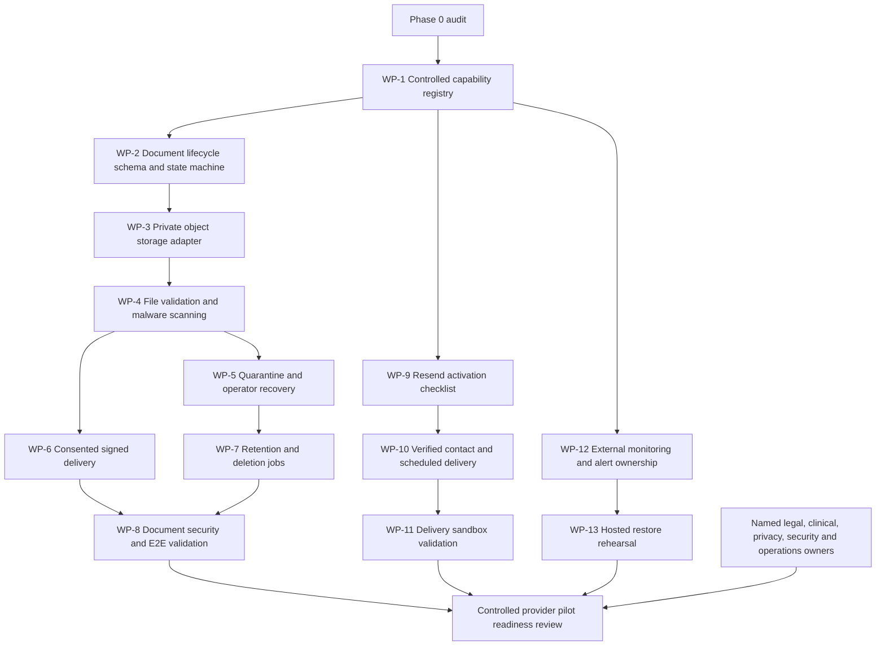

# Reyati implementation-readiness report

- Report version: 1.0
- Repository state audited: `1706564af8bd32ea91ca23d94950458a64d9b8f6`
- Audit date: 15 August 2026
- Source plan: Reyati Codex Implementation Master Plan 1.0
- Environment: main Reyati application

## Executive verdict

Reyati has a healthy, deployable product foundation and is substantially beyond a visual prototype. Patient discovery and booking, provider operations, finalized encounter records, family delegation, notifications, support, organization administration, provider verification, audit, and operational reporting are implemented against persistent D1 data with server-side authorization.

The application is **implementation-complete for its current owner-only foundation**, but it is **not yet controlled-pilot ready** and must not be described as public-launch ready. The remaining pilot blockers are explicit rather than hidden:

1. Transactional email is implemented through an outbox, templates, Resend adapter, retry processor, suppression handling, and verified webhook boundary, but external delivery and scheduling are disabled.
2. Medical-document ownership, metadata, consent, expiry, and revocation exist, but object upload, malware scanning, quarantine operations, and protected byte delivery are disabled.
3. Privacy-safe operational signals and durable rate limits exist, but external error/performance monitoring, alert delivery, named on-call ownership, retention automation, and a hosted restoration rehearsal do not.
4. Payment records are read-only; checkout, refunds, reconciliation, and settlements are correctly unavailable pending provider and commercial decisions.
5. Pilot operating procedures exist as drafts, but named accountable owners, clinical/legal review, provider agreements, consent materials, and a real-provider rehearsal remain external work.

The recommended next engineering milestone is the **secure medical-document lifecycle package**, implemented behind the existing hard-disabled activation gate. It should add upload-session state, private-object references, scanning and quarantine events, deletion jobs, operator recovery, and signed delivery boundaries without accepting a real file until storage and malware-scanner dependencies are approved.

## Current repository health

| Area | Evidence | Verdict |
| --- | --- | --- |
| Framework | React 19, Next 16-compatible source, vinext/Vite Cloudflare build | Healthy |
| Hosting | OpenAI Sites project with D1 binding; no R2 binding | Healthy for current scope; document bytes blocked |
| Pages | 31 application pages | Broad role coverage |
| APIs | 33 protected API routes | Broad domain coverage |
| Database | 38 Drizzle tables and 21 expand-only migrations | Healthy migration foundation |
| Automated tests | 69 tests across foundation safety and rendered workflows | Passing |
| Privileged workflow | Isolated patient/provider/admin workflow previously passed against migrated local D1 | Passing |
| Type safety | `tsc --noEmit` | Passing |
| Static analysis | ESLint | Passing |
| Production build | `vinext build` | Passing |
| Production dependencies | `npm audit --omit=dev --audit-level=high` | Zero vulnerabilities |
| Source control | Clean main branch after Sites release 91 | Healthy |
| Production access | Owner-only Sites deployment | Appropriate for current stage |

No feature had to be changed to complete this audit.

## Existing feature map

### Live foundation

- ChatGPT-hosted identity resolution and durable internal user records.
- Patient dashboard, verified provider discovery, service catalogues, availability, and concurrency-safe booking.
- Patient appointment history and eligible cancellation.
- Provider onboarding, organization membership, verification, publication, services, fees, availability, and schedule operations.
- Provider confirm, decline, complete, patient-directory, encounter-draft, concurrency, finalization, and immutable-record workflows.
- Patient-owned finalized health-record wallet and account-owned payment-status ledger.
- Scoped family consent, invitations, revocation, expiry, and delegated appointment/record/payment access.
- Durable in-app notifications and support-case conversations.
- Organization provisioning, first-administrator bootstrap, platform role invitations, and final-administrator protection.
- Provider and organization review decisions with audit records.
- Live platform overview, audit ledger, support operations, read-only finance oversight, and operational health centre.
- Persistent English/Arabic preference and RTL coverage across all client pages.
- Accessible dialogs, form validation, focus handling, recovery, offline states, and sensitive-action confirmations.

### Role-gated foundation

- Provider schedule, patient directory, encounters, catalog management, and insights.
- Organization ownership and administration.
- Platform administration, verification, audit, security-auditor, and support roles.
- Metadata-only provider visibility into active, purpose-specific document grants.

### Truthfully inactive or read-only

- Payment checkout, refunds, reconciliation, and settlement.
- Independent consumer authentication and MFA.
- SMS and WhatsApp delivery.
- Partner programme creation and publication.
- Review moderation without a genuine review source.
- External credential verification.

## Missing feature map

| Master-plan requirement | Current state | Classification | Primary dependency |
| --- | --- | --- | --- |
| Real transactional delivery | Adapter and operations foundation only | Integration-dependent | Sending domain, Resend secrets, approved templates, schedule |
| Medical-document bytes | Metadata and sharing foundation only | Missing/blocked | Private R2, scanner, retention policy |
| Refunds and settlement | Read-only ledger only | Blocked | Payment provider and commercial model |
| Error/performance monitoring | Internal redacted signals only | Integration-dependent | Approved telemetry vendor |
| Security alerting | Dashboard only | Missing/blocked | Alert transport, thresholds, recipients, rota |
| Automated retention | Hooks and states only | Missing/blocked | Approved schedules and legal-hold policy |
| Hosted restore rehearsal | Runbook only | Operationally missing | Backup evidence and named database owner |
| Real-provider pilot | Procedures drafted | Operationally missing | Partner, agreements, owners, rehearsal |
| Care Navigator | Not started | Phase 2, intentionally deferred | Clinical owner and reviewed routing rules |
| OCR and report extraction | Not started | Phase 2, intentionally deferred | Secure upload foundation and evaluation data |
| Telemedicine and fulfilment | Not started | Phase 3, intentionally deferred | Licensed partners and contracts |

## Partial implementations

### Transactional communications

Implemented:

- Vendor-neutral D1 outbox.
- Versioned Arabic and English templates.
- Appointment, verification, record, family, and support event coverage.
- Account preferences and locale.
- HMAC-signed verification and invitation links generated at dispatch time.
- Resend HTTP adapter with idempotency.
- Bounded leased retries and abandoned-lease recovery.
- Webhook signature, replay, bounce, complaint, and suppression handling.
- Privacy-minimized operations workspace.

Still required:

- Approved custom sending domain and DNS configuration.
- Hosted secrets and restricted sender identity.
- Independently verified recipient contact activation.
- Scheduled trigger.
- Template, privacy, support, and deliverability approval.
- Named communications and incident owners.

### Medical documents

Implemented:

- Patient ownership and metadata model.
- Document lifecycle fields.
- Purpose-specific provider grants.
- Appointment-linked verified-provider eligibility.
- Consent records, 1–30 day expiry, revocation, and optimistic concurrency.
- Audit events and metadata-minimized provider view.
- Limits for PDF/JPEG/PNG, 10 MB, and 25 pages represented in the contract.

Still required:

- Upload-session state and idempotency.
- Private object-storage binding and object-key policy.
- Magic-byte and parser validation.
- Malware scanning and authenticated scanner callback.
- Page-count enforcement and decompression-bomb limits.
- Quarantine/rejection operator workflow.
- Signed, short-lived, authorization-checked byte delivery.
- Retention/deletion jobs and legal-hold behavior.
- Recovery, observability, and end-to-end security testing.

### Production operations

Implemented:

- Privacy-safe operational logger.
- Redaction rules and data classification.
- Durable D1 write rate limits.
- Role-scoped health dashboard.
- Incident, backup, and pilot runbook drafts.

Still required:

- External error and performance telemetry.
- Security alert routing and escalation.
- Named owner and backup rota.
- Hosted backup restoration evidence and measured RTO/RPO.
- Approved retention enforcement.

### Arabic and RTL

The UI implementation is complete across current client routes, including persistent language selection, Arabic typography, RTL direction, localized navigation, dates, statuses, forms, dialogs, and protected workspaces. Remaining work is human linguistic QA for clinical, legal, and medical terminology, plus representative mobile/desktop assistive-technology validation by native Arabic reviewers.

## Security and authorization gaps

Current server-side authorization is strong for the implemented scope: patient ownership, provider status and organization membership, platform roles, invitation identity binding, final-administrator protection, audit events, rate limits, and document-share eligibility are enforced on the server.

Remaining security gaps before a controlled pilot:

- ChatGPT-hosted identity is suitable for this owner-only environment but requires a formal authentication architecture decision for a public consumer pilot.
- No R2 binding or secure object-delivery channel exists; this correctly blocks medical-document bytes.
- Malware-scanner trust, callback authentication, replay handling, and quarantine ownership are undecided.
- No external SIEM/error/performance destination or security-alert channel is active.
- Account, clinical, financial, and document retention schedules are not approved or enforced.
- Provider-verification evidence remains manual and has no external credential source.
- Re-authorization for especially sensitive future actions has not been designed.
- A dedicated broken-access-control and file-leakage penetration test has not been completed.

## Database and migration impact

The current schema has 38 tables and 21 tracked migrations. Existing Phase 1 foundations already include identity/contact, notification preference, outbox, webhook receipt, suppression, operational rate-limit, consent, document record, and document share tables.

The next document-lifecycle package should use expand-only migrations for:

1. `document_upload_sessions` — owner, expected type/size, object key, status, expiry, idempotency key, and version.
2. `document_processing_events` — document, event type, scanner reference, privacy-safe reason code, occurred time, and dedupe key.
3. `document_access_grants` or equivalent delivery nonce ledger — short-lived, single-purpose byte-access authorization without exposing object keys.
4. `document_deletion_jobs` — eligibility, legal-hold state, attempts, lease, completion, and failure code.

No destructive migration is recommended. Existing metadata records and shares should remain valid.

## External integration dependencies

| Dependency | Required decision | Activation impact |
| --- | --- | --- |
| Resend | Sending domain, from/reply-to, API key, webhook secret, schedule | Enables transactional email only after review |
| Protected R2 | Bucket, binding, encryption/access policy, lifecycle policy | Enables private document object storage |
| Malware scanner | Vendor/service, callback authentication, failure policy | Enables document processing beyond quarantine |
| Monitoring vendor | Data classification, region, sampling, retention | Enables external error/performance visibility |
| Alert transport | Channel, recipients, severity thresholds, rota | Enables incident escalation |
| Payment provider | Provider, booking/payment model, refunds, settlements | Enables money movement |
| Credential source | Authoritative regulator/credential workflow | Strengthens provider verification |
| Real pilot partner | Organization, providers, agreements, SOP owners | Enables controlled pilot execution |

## UI and UX gaps

- Current role surfaces are complete and branded, but privileged screens contain dense operational tables that need task-based usability validation with real operators.
- Clinical and operational server-generated values may remain English unless the data layer supplies reviewed Arabic equivalents.
- The document interface intentionally shows inactive upload states until storage is safe.
- Payment and partner screens must continue to identify read-only or inactive capabilities.
- A real-user journey test is needed for mobile Arabic forms, long names, mixed Arabic/Latin identifiers, and low-bandwidth recovery.
- Investor guidance and synthetic persona switching belong in the separate investor application, not the main product.

## Arabic and accessibility gaps

Automated coverage prevents removal of locale persistence and RTL from critical routes. Current UI accessibility includes keyboard operation, focus trapping, error announcements, loading/error/empty states, reduced-motion support, and recovery behavior.

Human QA remains required for:

- Native Arabic copy and medical terminology.
- Bidirectional mixed-content behavior for names, IDs, email, dates, and dosage text.
- Screen readers on representative Windows, iOS, and Android combinations.
- Zoom and text reflow at 200–400 percent.
- Keyboard-only privileged workflows with realistic data volume.
- Contrast and focus verification in actual deployed browsers.

## Test coverage gaps

Current automated coverage is strong for source-level security invariants, rendered routes, error recovery, authorization contracts, invitation safety, concurrency, audit behavior, communications boundaries, and Arabic persistence.

Phase 1 additions needed:

- Real browser end-to-end tests for patient/provider/admin journeys.
- File fuzzing, magic-byte mismatch, malformed PDF, decompression-bomb, and parser limits.
- Object ownership and signed-download leakage tests.
- Malware-scanner timeout, replay, forged callback, and retry tests.
- Quarantine and deletion recovery tests.
- Activated Resend sandbox tests with bounce/complaint/retry scenarios.
- Restore rehearsal automation and evidence capture.
- External monitoring failure and alert-routing tests.
- Arabic screen-reader and mobile-browser regression coverage.

## Phase 1 dependency graph

Payments are a separate blocked branch and should not enter this graph until the provider and settlement model are approved. Arabic implementation is complete, with human QA feeding the pilot readiness review.

## Recommended first implementation milestone

### WP-2 — Secure document lifecycle core

Status: ready for product-owner approval; external activation remains blocked.

Scope:

- Add expand-only upload-session, processing-event, access-grant, and deletion-job records.
- Implement explicit state-transition functions with optimistic concurrency and idempotency.
- Add storage and scanner interfaces whose production implementations fail closed when bindings are absent.
- Add privacy-safe audit events and operator reason codes.
- Add authenticated API contracts for creating/cancelling an upload intent, processing status, and requesting a download grant.
- Keep `medicalDocumentUploads` false.
- Do not accept, persist, scan, or return document bytes.
- Add unit/integration tests for ownership, invalid transitions, replay, expiry, and disabled capability behavior.

Acceptance criteria:

1. Every transition is server-authorized and version-checked.
2. Duplicate client requests are idempotent.
3. Object keys never appear in general API responses, logs, or audit metadata.
4. Missing storage/scanner configuration fails closed.
5. Revoked/expired consent cannot produce a byte-access grant.
6. Quarantined, infected, failed, deleted, or non-owned documents cannot be shared or delivered.
7. Existing tests continue to pass and new document safety tests are added.
8. Capability status remains `foundation` until external dependencies and security validation are complete.

## Files expected to change for WP-2

- `db/schema.ts`
- `drizzle/0021_*.sql`
- `lib/medical-documents.ts`
- `lib/foundation-flags.ts` only if capability configuration is restructured without activation
- `lib/capability-registry.ts`
- `app/api/patient/documents/route.ts`
- New document upload/status/access API routes as justified by the final contract
- `app/documents/page.tsx`
- `app/provider/documents/page.tsx`
- `tests/foundation-safety.test.mjs`
- `tests/privileged-workflows.mjs`
- New focused document lifecycle tests
- `docs/adr/ADR-003-medical-document-foundation.md`
- `.env.example` and runtime types only for documented inactive bindings

## Risks and decisions requiring product-owner approval

The following decisions change architecture, commercial scope, or external risk and should not be inferred:

1. Approve WP-2 as the next engineering package while keeping file bytes disabled.
2. Select or defer the protected R2 bucket and its retention/lifecycle policy.
3. Select or defer the malware-scanning provider and quarantine operating owner.
4. Confirm whether Resend activation should run in parallel after the custom domain is available.
5. Name accountable product, engineering, security, privacy, clinical, support, provider-operations, communications, and database owners before pilot readiness can be claimed.
6. Decide whether independent consumer identity is required for the first pilot or whether the hosted identity boundary remains acceptable for a restricted rehearsal.
7. Select the payment and settlement model before any payment implementation begins.

## Capability-status updates

- Arabic and RTL: **implementation complete**, pending human linguistic/accessibility QA.
- Core marketplace and provider workflows: **live foundation** in the owner-only environment.
- Transactional communications: **foundation**, external delivery inactive.
- Medical documents: **foundation**, file handling inactive.
- Operational observability: **foundation**, external monitoring and alerting inactive.
- Payments: **read-only**.
- Controlled provider pilot: **not pilot ready**.
- Public launch: **not ready**.

## Investor-demo synchronization status

No source or data was synchronized into the investor environment during this audit. The investor application should inherit only stable main-product features. Medical upload, outbound email, monitoring, payment, and future AI features must remain labelled as inactive, pilot integration, or concept simulation until their main-product capability status changes.

## Rollback

This audit adds documentation only. Rollback is removal of this report; it does not change runtime code, data, configuration, or deployment state.
